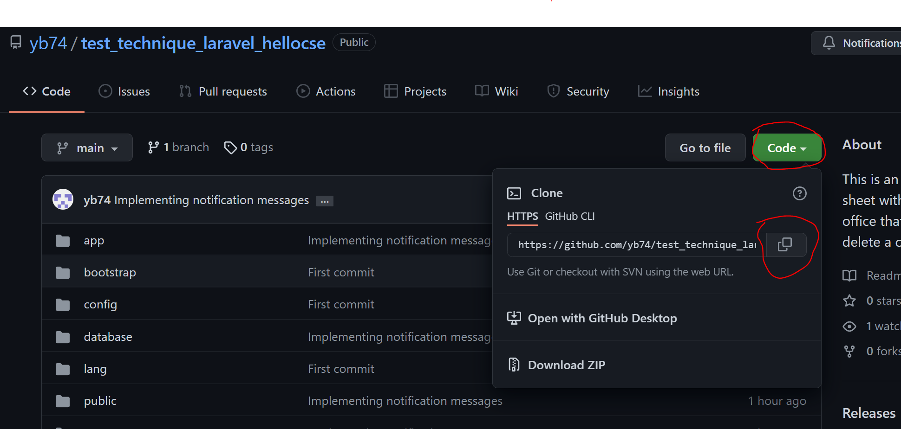

# Project Title

Celebrity News

## Description

Application that displays information about celebrities.
This app allows you to create, delete and modify a celebrity card.

## Getting Started

### Dependencies

* Describe any prerequisites, libraries, OS version, etc., needed before installing program.
* Composer 2.1.14
* Laravel 9
* PHP 8.1.0

### Installing

* Install Wamp, Mamp or Xamp according to your operating system to get apache and MySql
* Install composer
* At the root of the repo, click on clone button, then click on the folder button to copy the repo url (see the image below)



* open a terminal and launch the following command 'git clone [repo url you copied]' to clone the project as below :

```
git clone https://github.com/yb74/test_technique_laravel_hellocse.git
```

### Executing program

* Install the dependencies of the project by running the command below :

```
composer install
```

* Install npm dependencies by running the command below :

```
npm install
```

* Configure your .env file to set the connection to the database... (see doc : https://laravel.com/docs/9.x/configuration#environment-configuration)
* You can generate faker dummy data to be sent to the database by running this command :

```
php artisan tinker
php code => Celebrity::factory()->count(10)->create();
```

note : documentation of Faker : https://fakerphp.github.io/formatters/text-and-paragraphs/

* Run the following command to migrate your data to the database :

```
php artisan migrate
```

* Now you can run this command to launch your app :

```
php artisan serve
```

## Help

If you have an error of composer, npm or php version, make sure to update them.
You can update composer and npm depensdencies with the following command :

For composer :
```
composer update
```

For npm :
```
npm update
```

## Authors

Contributors names and contact info

Younes Bouaziz
Website : https://younesbouaziz.com

<!-- ## Version History

* 0.2
    * Various bug fixes and optimizations
    * See [commit change]() or See [release history]()
* 0.1
    * Initial Release

## License

This project is licensed under the [NAME HERE] License - see the LICENSE.md file for details -->

<!-- ## Acknowledgments

Inspiration, code snippets, etc.
* [awesome-readme](https://github.com/matiassingers/awesome-readme)
* [PurpleBooth](https://gist.github.com/PurpleBooth/109311bb0361f32d87a2)
* [dbader](https://github.com/dbader/readme-template)
* [zenorocha](https://gist.github.com/zenorocha/4526327)
* [fvcproductions](https://gist.github.com/fvcproductions/1bfc2d4aecb01a834b46) -->